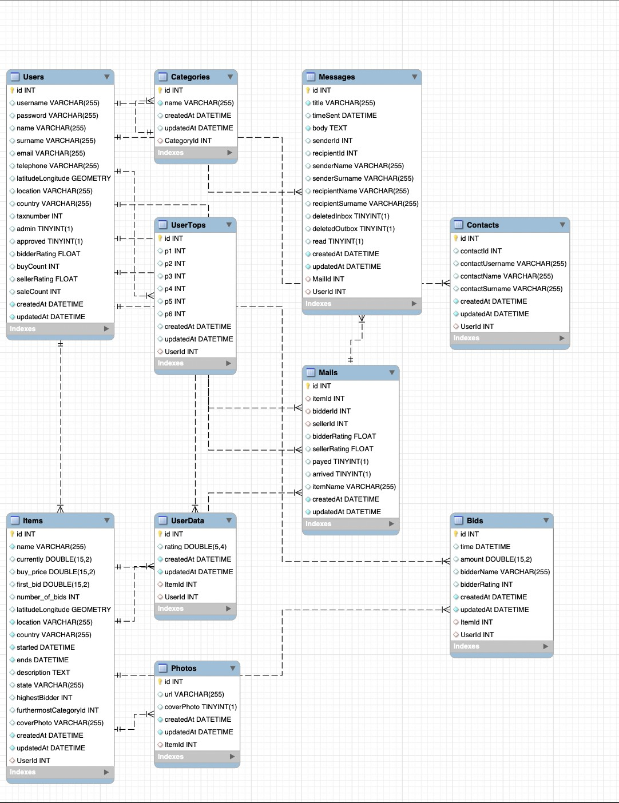
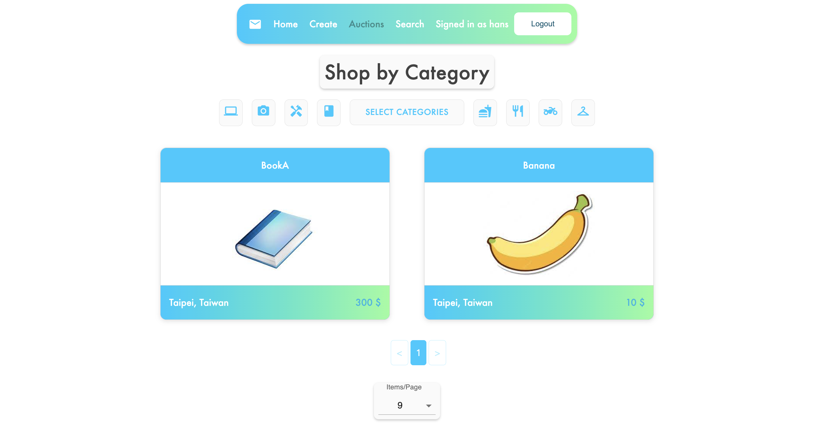
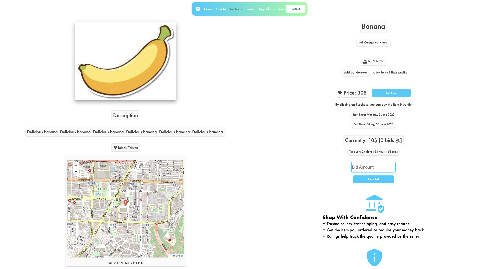
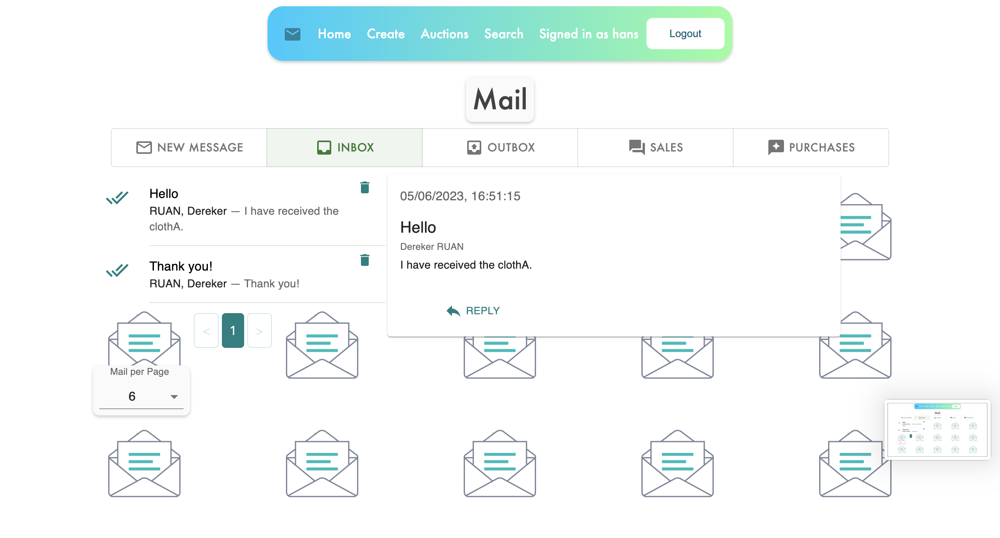
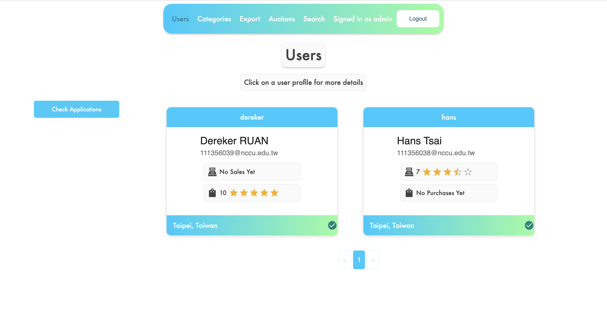
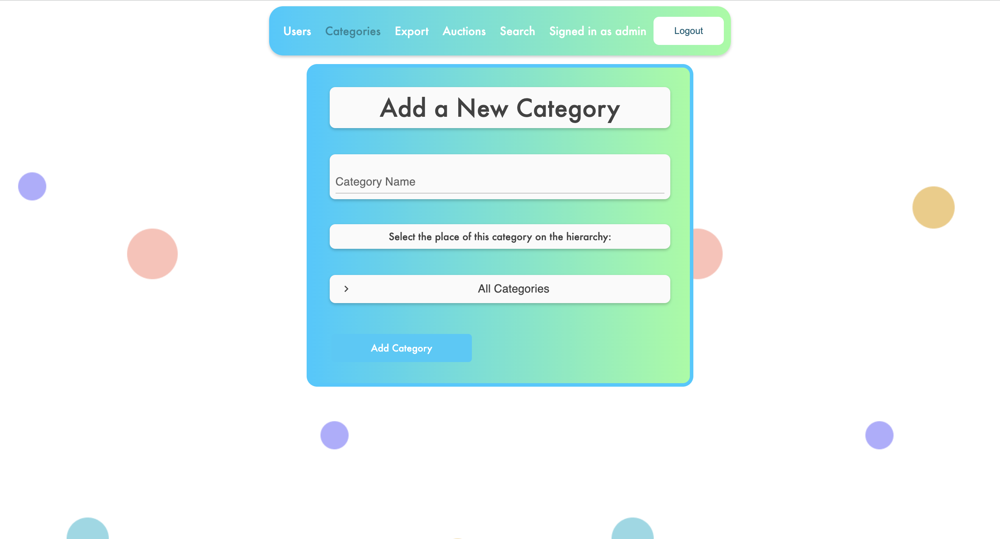
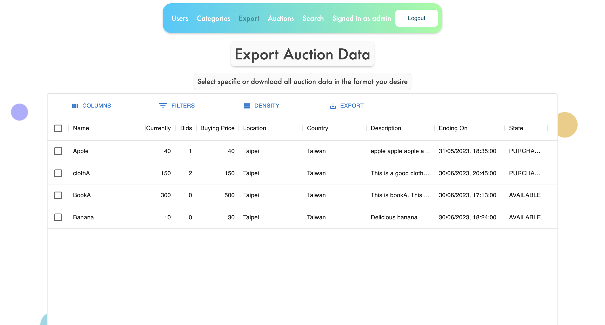

# NCCU second-hand goods auction platform

這是一個提供政大學生的二手物拍賣平台，我的目標是仿照 eBay 拍賣網站的架構，建立一個線上的拍賣平台。以下是主要的功能:
- **基於角色的權限管理 (RBAC)**
- **管理者**(admin)
    + 審核新的使用者申請要求
    + 建立新的商品分類
    + 匯出商品資訊報表 (csv, json, xml)
- 商品搜尋
    + 關鍵字搜尋 (text search)
    + 商品分類搜尋 (category)
    + 商品篩選 (filter)
- 競標 (bid)
    + 買家可對商品進行競標 (出價、購買)
    + 賣家可對商品進行拍賣 (設定起標價格、最低得標價格、截止時間)
- 買家、賣家可利用**平台站內信聯繫溝通**
- 買家、賣家可於完成交易後，**互相評價**此次交易

## Diagrams
### EERD
- 

### Control Flow Diagram
- 

### Technologies
- **Backend**: Node.js, Express, Sequelize
- **Frontend**: React, Material UI
- **Database**: MySQL


## Requirements & Setup
### Back-end (api/)
- 設定 [config.json](./api/config/config.json) 的內容
- 安裝後端所需的套件
    + $ `npm install`
- 因為交易(transactions)是需要被加密保護的，因此我們可以利用 [mkcert](https://w3c.hexschool.com/blog/cd7b449b) 來建立一個給 local 端環境測試用的憑證，來模擬 SSL/TLS 加密的環境
    + $ `mkcert -install`
    + $ `mkcert localhost`
    + ```js
      const sslServer = https.createServer({
        key: fs.readFileSync('/yourpath/key.pem'),
        cert: fs.readFileSync('/yourpath/cert.pem')
      }, app);
      ```
- 初始化 MySQL 資料庫
    + $ `sequelize init`
    + 管理者帳密(預設)
        * 帳號: `admin`
        * 密碼: `1234`
- 啟動後端伺服器
    + $ `npm start`

### Front-end (front/)
- 安裝前端所需的套件
    + $ `npm install`
- 啟動前端
    + $ `npm start`

## Design
- CSS
- Material UI

### Welcome Page


### Auctions


### Auction Page

- 使用 OpenStreetMap 與 [Leaflet.js](https://leafletjs.com/) 來顯示商品所在的精確位置

### Login & Registration

- 前端驗證輸入的資料格式: [yup](https://www.npmjs.com/package/yup), [formik](https://www.npmjs.com/package/formik)
- 後端儲存密碼的加密方式: [bcrypt](https://www.npmjs.com/package/bcrypt)

### Mail

- 當**得標**時，買家可以透過平台站內信與賣家聯繫溝通
- 當**商品售出**時，賣家可以透過平台站內信與買家聯繫溝通
- 一般情況下，買、賣家也可以主動寄出站內信與平台上的其他使用者溝通

### Admin
- 審核新的使用者申請要求
    + 
- 建立新的商品分類
    + 
- 匯出商品資訊報表
    + 

## References
- [Full Stack e-commerce app built with Express, Node.js, MySQL and React](https://reactjsexample.com/full-stack-e-commerce-app-built-with-express-node-js-mysql-and-react/#)
- [GitHub repo: Themiscodes/Auction-Website](https://github.com/Themiscodes/Auction-Website?ref=reactjsexample.com)
